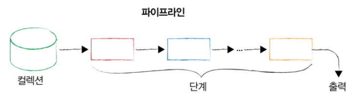
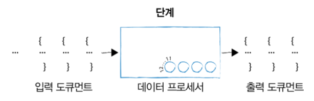
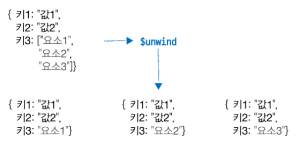
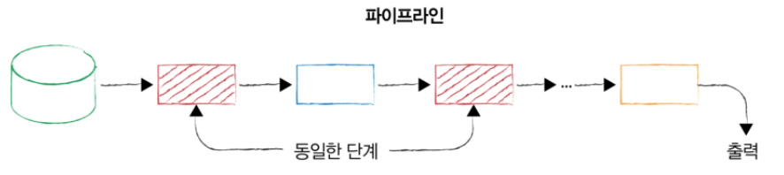

# 집계 프레임워크

## 파이프라인, 단계 및 조정 가능 항목

- 집계 프레임워크는 파이프라인 개념을 기반으로 한다
    
    
    
    - 집계 파이프라인은 단계마다 특정 작업을 수행한다
    - 각 단계는 특정한 형태의 도큐먼트를 입력받고 도큐먼트 스트림을 생성한다
- 집계 파이프라인의 개별 단계는 ‘데이터 처리’ 단위다
    
    
    
    - 한 번에 입력 도큐먼트 스트림을 하나씩 가져와서 각 도큐먼트를 하나씩 처리하고 출력 도큐먼트 스트림을 하나씩 생성한다
    - 각 단계는 tunables 셋을 제공하는데, 이 tunables은 일반적으로 필드를 수정하거나 산술 연산을 수행하거나 도큐먼트를 재구성하거나 일종의 누산 작업 등 여러 작업을 수행하는 연산자의 형태를 취한다

## 단계 시작하기 : 익숙한 작업들

- 지금부터 match, projection, sort, skip, limit 단계를 살펴보자
- 예제는 companies라는 회사 데이터 컬렉션을 사용한다
    - 컬렉션에는 회사 이름, 간단한 설명, 설립 시기, 펀딩 라운드, 회사 중대 사건, IPO 여부 등 세부 정보를 지정하는 여러 필드가 있다
        
        ```json
        {
          "_id" : "52cdef7c4bab8bd675297d8e",
          "name" : "Facebook",
          "category_code" : "social",
          "founded_year" : 2004,
          "description" : "Social network",
          "funding_rounds" : [{
              "id" : 4,
              "round_code" : "b",
              "raised_amount" : 27500000,
              "raised_currency_code" : "USD",
              "funded_year" : 2006,
              "investments" : [
                {
                  "company" : null,
                  "financial_org" : {
                    "name" : "Greylock Partners",
                    "permalink" : "greylock"
                  },
                  "person" : null
                },
                {
                  "company" : null,
                  "financial_org" : {
                    "name" : "Meritech Capital Partners",
                    "permalink" : "meritech-capital-partners"
                  },
                  "person" : null
                },
                {
                  "company" : null,
                  "financial_org" : {
                    "name" : "Founders Fund",
                    "permalink" : "founders-fund"
                  },
                  "person" : null
                },
                {
                  "company" : null,
                  "financial_org" : {
                    "name" : "SV Angel",
                    "permalink" : "sv-angel"
                  },
                  "person" : null
                }
              ]
            },
            {
              "id" : 2197,
              "round_code" : "c",
              "raised_amount" : 15000000,
              "raised_currency_code" : "USD",
              "funded_year" : 2008,
              "investments" : [
                {
                  "company" : null,
                  "financial_org" : {
                    "name" : "European Founders Fund",
                    "permalink" : "european-founders-fund"
                  },
                  "person" : null
                }
              ]
            }],
          "ipo" : {
            "valuation_amount" : NumberLong("104000000000"),
            "valuation_currency_code" : "USD",
            "pub_year" : 2012,
            "pub_month" : 5,
            "pub_day" : 18,
            "stock_symbol" : "NASDAQ:FB"
          } 
        }
        ```
        
- 여기서, 2004년에 설립된 회사의 이름과 설립년도를 조회해보자
    
    ```json
    db.companies.aggregate([
      {$match: {founded_year: 2004}},
      {$project: {
        _id: 0,
        name: 1,
        founded_year: 1
      }} 
    ])
    ```
    
    ```json
    {"name": "Yelp", "founded_year": 2004 }
    {"name": "Wink", "founded_year": 2004 }
    {"name": "Digg", "founded_year": 2004 }
    {"name": "Jobster", "founded_year": 2004 }
    {"name": "Eventful", "founded_year": 2004 }
    {"name": "Sway", "founded_year": 2004 }
    {"name": "Redfin", "founded_year": 2004 }
    {"name": "Oodle", "founded_year": 2004 }
    {"name": "AddThis", "founded_year": 2004 }
    :
    :
    ```
    
- `aggregate`는 집계 쿼리를 실행할 때 호출하는 메소드다
    - 집계를 위해 집계 파이프라인을 전달하는데, 파이프라인은 도큐먼트를 요소로 포함하는 배열이다
    - 각 도큐먼트는 특정 단계 연산자를 규정해야 한다
- 위 파이프라인은 두 단계를 포함한다
    1. 필터링을 위한 `match` 단계와
    2. 출력을 도큐먼트당 두 개 필드로 제한하는 `projection` 단계
    - `match` 단계는 컬렉션에 대해 필터링하고 결과 도큐먼트를 한 번에 하나씩 `projection` 단계로 전달한다
    - `projection` 단계는 작업을 수행하고 도큐먼트 모양을 변경한 후 출력을 전달한다
- 이제 `limit` 단계를 추가하고 projection을 수정해보자
    
    ```json
    db.companies.aggregate([
      {$match: {founded_year: 2004}},
      {$limit: 5},
      {$project: {
        _id: 0,
        name: 1
      }} 
    ])
    ```
    
    ```json
    {"name": "Yelp"}
    {"name": "Wink"}
    {"name": "Digg"}
    {"name": "Jobster"}
    {"name": "Eventful"}
    ```
    
    - `limit` 단계를 `projection` 전에 수행하도록 했다는 것에 주목하자
    - `limit` 단계가 `proejction` 이후였다면, 결과를 5개로 제한하기 전에 `proejction` 단계를 통해 수백 개의 도큐먼트를 전달해야 한다
    - 쿼리 플래너가 수행할 수 있는 최적화 유형에 관계 없이 항상 집계 파이프라인의 효율성을 고려해야 한다
    - 파이프라인을 구축할 때 한 단계에서 다른 단계로 전달해야 하는 도큐먼트 수를 반드시 제한하자
    - 위같은 경우에는 사실상 처음 5개의 도큐먼트에만 관심이 있기 때문에 두 번째 단계로 limit이 들어가는 것이 좋다
- 만약 순서가 중요하다면 `sort`를 추가해야 한다
    
    ```json
    db.companies.aggregate([
      {$match: {founded_year: 2004}},
      {$sort: {name:1}},
      {$limit: 5},
      {$project: {
        _id: 0,
        name: 1
      }} 
    ])
    ```
    
- `skip`은 건너뛰기를 할 수 있다
    - 정렬 후에 처음 10개를 건너띄고 다음 5개를 조회한다면 skip을 사용한다
        
        ```json
        db.companies.aggregate([
          {$match: {founded_year: 2004}},
          {$sort: {name:1}},
          {$skip: 10},
          {$limit: 5},
          {$project: {
            _id: 0,
            name: 1
          }} 
        ])
        ```
        

## 표현식

집계 프레임워크는 다양한 표현식 클래스를 지원한다

- 불리언 표현식 : AND, OR, NOT 표현식을 쓸 수 있다
- 집합 표현식 : 배열을 집합으로 사용할 수 있다 (2개 이상의 집합의 교집합이나 합집합 등을 이용할 수 있다)
- 비교 표현식 : 다양한 유형의 범위 필터를 표현할 수 있다
- 산술 표현식 : 곱하기, 나누기, 더하기, 빼기 뿐 아니라 올림, 내림, 로그 등 복잡한 계산도 수행할 수 있다
- 문자열 표현식 : 문자열 연결, 문자열 검색, 대소문자 및 텍스트 검색과 관련된 작업을 수행할 수 있다
- 배열 표현식 : 배열 요소를 필터링하거나 배열을 분할하거나 특정 배열에서 값의 범위를 가져오는 등 배열을 조작하는 데 유용하다
- 가변적 표현식 : 리터럴 날짜 값 구문 분석을 위한 식, 조건식을 사용한다
- 누산기 : 합계 기술 통계 등 기타 여러 유형의 값을 계산하는 기능을 제공한다

## $project

- 조금 복잡한 `projection`을 살펴보자
- 중첩 필드 승격시키기
    - ipo.pub_year, ipo.valuation_amount, funding_rounds.investments.financial_org.permalink 필드를 최상위로 승격시켜 Proejction해보자
    
    ```json
    db.companies.aggregate([
      {$match: {"funding_rounds.investments.financial_org.permalink": "greylock" }},
      {$project: {
        _id: 0, 
        name: 1,
        ipo: "$ipo.pub_year",
        valuation: "$ipo.valuation_amount",
        funders: "$funding_rounds.investments.financial_org.permalink"
      }} 
    ]).pretty()
    ```
    
    - $문자는 projection 단계에서 ip, valuation, funders에 대한 값을 지정하는데 사용된다
    - 해당 값이 필드 경로로 해석되고 각 필드에서 선출할 값을 선택하는데 사용됨을 나타낸다


## $unwind

- 집계 파이프라인에서 배열 필드로 작업할 때, 종종 지정된 배열 필드의 각 요소에 대해 출력 도큐먼트가 하나씩 있는 출력을 생성해야 할 수도 있다
- $unwind는 입력 도큐컨트에서 배열을 가져오고 해당 배열의 각 요소에 대한 출력 도큐먼트를 생성해준다
    
    
    
    - 입력 도큐먼트에 세 개의 키와 값이 있다
    - 세 번째 키의 값은 요소가 3개인 배열이다
    - $unwind는 이와 같은 입력 도큐먼트에서 key3 필드를 전개하여 화살표 아래와 같은 도큐먼트 3개를 생성한다
- companies 예시로 살펴보면
    - unwind하지 않았을 때
        
        ```json
        db.companies.aggregate([
          {$match: {"funding_rounds.investments.financial_org.permalink": "greylock" }},
          {$project: {
            _id: 0, 
            name: 1,
        		amount: "$founding_rounds.raised_amount",
        		year: "$founding_rounds.funded_year"
          }} 
        ]).pretty()
        ```
        
        ```json
        {
        	"name":"Digg",
        	"amount": [8500000, 280000, 28700000, 5000000],
        	"year": [2006, 2005, 2008, 2011]
        }
        {
        	"name":"Facebook",
        	"amount": [50000, 127000000, 27500000],
        :
        ```
        
        - 쿼리는 founding_rounds 배열의 모든 요소에 대해 raised_amount 및 founded_year에 접근한다
        - amount와 year 둘 다에 대한 배열이 있는 도큐먼트를 생성한다
    - unwind하여 전개했을 때
        
        ```json
        db.companies.aggregate([
          {$match: {"funding_rounds.investments.financial_org.permalink": "greylock" }},
        	{$unwind: "$founding_rounds"}
          {$project: {
            _id: 0, 
            name: 1,
        		amount: "$founding_rounds.raised_amount",
        		year: "$founding_rounds.funded_year"
          }} 
        ]).pretty()
        ```
        
        ```json
        {"name":"Digg", "amount":8500000, "year": 2006},
        {"name":"Digg", "amount":280000, "year": 2005},
        {"name":"Digg", "amount":28700000, "year": 2008},
        {"name":"Digg", "amount":5000000, "year": 2011},
        {"name":"Facebook", "amount":50000, "year": 2004},
        {"name":"Facebook", "amount":127000000, "year": 2005},
        {"name":"Facebook", "amount":27500000, "year": 2006},
        :
        :
        ```
        
        - 전개 단계는 입력으로 받은 모든 도큐먼트의 사본을 생성한다
        - 값은 founding_rounds 도큐먼트의 배열이 아니라 각 펀딩 라운드에 해당하는 단일 도큐먼트가 된다
    - greylock이 한번이라도 펀딩 라운드에 참여한 회사의 greylock이 참여한 펀딩라운드만 조회하기
        
        ```json
        db.companies.aggregate([
          {$match: {"funding_rounds.investments.financial_org.permalink": "greylock" }},
        	{$unwind: "$founding_rounds"}
          {$project: {
            _id: 0, 
            name: 1,
        		funder: "$founding_rounds.investments.financial_org.permalink"
        		amount: "$founding_rounds.raised_amount",
        		year: "$founding_rounds.funded_year"
          }} 
        ]).pretty()
        ```
        
        - projection 단계에 필드를 추가했다
        - 하지만! 이것은 우리가 의도한 대로 흘러가지 않는다
            - 왜냐하면 greylock이 한번이라도 펀딩 라운드에 참여한 회사의 모든 investments 정보가 전개되어 조회되기 때문이다
            - 이유는 바로 investments 필드 때문인데, invetsments는 필드 자체가 배열이기 때문에 각 펀딩 라운드에 대해 여러 자금 지원자가 참여할 수 있으므로 참여한 자금 지원자 모두가 나열된다
        - 또다른 문제는, 파이프라인을 구성한 방식 때문에 그레이록이 참여하지 않은 펀딩 라운드를 나타내는 많은 도큐먼트가 projection 단계로 전달된다
        - match 단계에서 그레이록이 한번이라도 펀딩 라운드에 참여한 회사를 모두 선택하기 때문이다
    - 정말로 그레이록이 실제로 참여한 펀딩 라운드만 조회해보기
        - 방법 1 : 전개 단계와 일치 단계의 순서를 바꾼다
            - 전개를 먼저 다 한 후에 match 한다
            - → 의도한대로 값이 출력된다
            - 하지만, 첫 번째 단계에서 전개를 할 경우 전체 컬렉션을 스캔해야 한다
        - 방법 2 : 첫 번째 단계에서 match 단계를 진행한 후, 전개 후에 한 번 더 match 단계를 추가한다
            
            ```json
            db.companies.aggregate([
              {$match: {"funding_rounds.investments.financial_org.permalink": "greylock" }},
            	{$unwind: "$founding_rounds"}
              {$match: {"funding_rounds.investments.financial_org.permalink": "greylock" }},
              {$project: {
                _id: 0, 
                name: 1,
            		funder: "$founding_rounds.investments.financial_org.permalink"
            		amount: "$founding_rounds.raised_amount",
            		year: "$founding_rounds.funded_year"
              }} 
            ]).pretty()
            ```
            
        - 이처럼, 같은 유형의 단계를 여러 번 포함해야 할 때가 많다
        - 살펴봐야 하는 도큐먼트 개수를 줄이기 위해 필터링하고, 실제 원하는 값을 조회하기 위해 같은 단계가 반복되어 나타나기도 한다
            
            
            

## 배열 표현식

- 그레이록이 참여한 펀딩 라운드에 raised_amount가 1억달러 이상인 요소만 선택하자
    
    ```json
    db.companies.aggregate([
      {$match: {"funding_rounds.investments.financial_org.permalink": "greylock" }},
      {$project: {
        _id: 0, 
        name: 1,
    		funded_year: 1,
    		rounds: { $filter: {
    			input: "$founding_rounds",
    			as: "round",
    			cond: { $gte: ["$$round.raised_amount", 100000000]} 
    		} }
      }} 
      {$match: {"funding_rounds.investments.financial_org.permalink": "greylock" }},
    ]).pretty()
    ```
    
    - $filter의 첫 번째 옵션 input : 배열을 지정한다. 여기서는 founding_rounds 배열을 선택했다
    - $filter의 두 번째 옵션 as : founding_rounds 배열에 사용할 이름을 지정
    - $filter의 세 번째 옵션 cond : 조건을 지정. input으로 지정한 배열을 필터링하여 서브셋을 선택한다
        - 여기서 $$을 사용하여 작업 중인 표현식 내에서 정의된 변수를 참조하도록 했다
        - as는 필터 표현식 내에서 변수를 정의한다
- 배열 요소 연산자 $arrayElemAt
    - $arrayElemAt를 통해 배열 내 특정 슬롯에서 요소를 선택할 수 있다
    - 선출할 필드를 정의하고 값으로 $arrayElemAt을 필드 이름으로 사용한다
    - 두 요소 배열을 전달하여 도큐먼트를 지정한다
        - 첫 번째 요소 : 선택하려는 배열 필드
        - 두 번째 요소 : 배열 내 슬롯 선택 (0은 첫 번째 인덱스, -1은 마지막 인덱스)
        
        ```json
        db.companies.aggregate([
          {$match: {"founded_year": 2010 }},
          {$project: {
            _id: 0, 
            name: 1,
        		funded_year: 1,
        		first_round: { $arrayElemAt : ["$founding_rounds", 0]},
        		last_round: { $arrayElemAt : ["$founding_rounds", -1]}
          }} 
        ]).pretty()
        ```
        
- 배열의 여러 항목을 반환하는 $slice
    - 배열의 특정 인덱스에서 시작해 여러 항목을 순서대로 반환한다
        
        ```json
        db.companies.aggregate([
          {$match: {"founded_year": 2010 }},
          {$project: {
            _id: 0, 
            name: 1,
        		funded_year: 1,
        		early_rounds: { $slice : ["$founding_rounds", 1, 3]}
          }} 
        ]).pretty()
        ```
        
    - 여기서도 early_rounds 배열에서 인덱스 1부터 시작해 3개의 요소를 가져온다
- $size : 배열의 크기나 길이를 반환한다
    
    ```json
    db.companies.aggregate([
      {$match: {"founded_year": 2010 }},
      {$project: {
        _id: 0, 
        name: 1,
    		funded_year: 1,
    		total_rounds: { $size : ["$founding_rounds"]}
      }} 
    ]).pretty()
    ```
    

## 누산기

- 집계 프레임워크가 제공하는 누산기로 다양한 것이 있다
    - $sum
    - $avg
    - $first
    - $last
    - $max
    - $min
    - $mergeObjects
- mongodb 3.2 이전에서는 누산기를 그룹 단계에서만 사용할 수 있었지만 그 이후부터는 선출 단계에서 누산기를 사용할 수 있게 되었다
    - 선출 단계에서는 $sum, $avg같은 누산기가 단일 도큐먼트 내 배열에서만 작동하고,
    그룹 단계에서는 여러 도큐먼트에 걸쳐 계산을 수행한다
- 선출 단계에서 누산기 사용
    
    ```json
    db.companies.aggregate([
      {$match: {"funding_rounds": {$exists: true, $ne: []} }},
      {$project: {
        _id: 0, 
        name: 1,
    		largest_round: {$max: "$funding_rounds.raised_amount"}
      }} 
    ]).pretty()
    
    db.companies.aggregate([
      {$match: {"funding_rounds": {$exists: true, $ne: []} }},
      {$project: {
        _id: 0, 
        name: 1,
    		total_round: {$sum: "$funding_rounds.raised_amount"}
      }} 
    ]).pretty()
    ```
    
    - $funding_rounds은 각 회사 도큐먼트 내 배열이므로 누산기를 사용할 수 있다
    - 배열에 포함된 도큐먼트에 도달하여 출력 도큐먼트에 최댓값과 합계를 선출한다
    

## 그룹화 소개

- 그룹 단계는 SQL GROUP BY 명령과 유사한 기능을 수행한다
- 그룹 단계에서는 여러 도큐먼트의 값을 함께 집계하고 집계한 값에 평균 계산과 같은 집계 작업을 수행할 수 있다
    
    ```json
    db.companies.aggregate([
    	{ $group: {
    		_id: {founded_year:"$founded_year"},
    		average_number_of_employees: {$avg: "$number_of_employees"}
    	}},
    	{ $sort: { average_number_of_employees: -1 } }
    ]).pretty()
    ```
    
    - 설립 연도를 기준으로 모든 회사를 합친 다음, 연도마다 평균 직원 수를 계산한다
    - _id 값으로 $group 연산자 자체의 값이 선택된다
    - 그룹 단계가 첫 번째이므로 aggregate 명령은 companies 컬렉션의 모든 도큐먼트를 그룹 단계를 통해 전달한다
    - 그룹 단계에서는 founded_year에 대해 동일한 값을 갖는 모든 도큐먼트를 단일 그룹으로 취급한다
    - 필드의 값을 구성할 때 단계에서는 $avg 누산기를 사용해 founded_year가 동일한 모든 회사의 평균 직원 수를 계산한다

## 그룹 단계의 _id 필드

- 그룹 집계 단계에서 _id 필드 값을 구성하는 모범 사례
    
    ```json
    db.companies.aggregate([
    	{ $match: {founded_year: {$gte:2013 }}},
    	{ $group: {
    		_id: {founded_year:"$founded_year"},
    		companies: {$push:"$name"}
    	}},
    	{ $sort: {"_id.founded_year":1}}
    ]).pretty()
    ```
    
    ```json
    {
    	"_id": {
    		"founded_year" : 2013
    	},
    	"compnaies" : [
    		"Fixya",
    		"Wamba",
    		"Adaliant",
    		:
    	]
    }
    ```
    
    - _id에 설립 연도를 바로 제공하는게 아니라,
    그룹 값에 레이블을 지정하여 회사 설립 연도를 기준으로 그룹화한다는 점이 분명하게 드러나도록
    founded_year라고 레이블된 필드가 있는 도큐먼트에 넣었다
    - 혼동을 피하려면 그룹화할 값에 명시적으로 레이블을 지정하는 것이 좋다
- 경우에 따라 여러 필드로 구성된 도큐먼트가 _id값인 방식에 사용될 수도 있다
    
    ```json
    db.companies.aggregate([
    	{ $match: {founded_year: {$gte:2013 }}},
    	{ $group: {
    		_id: {founded_year:"$founded_year", category_code:"$category_code"},
    		companies: {$push:"$name"}
    	}},
    	{ $sort: {"_id.founded_year":1}}
    ]).pretty()
    ```
    
- 내장 도큐먼트 내 필드를 사용할 수도 있다
    
    ```json
    db.companies.aggregate([
    	{ $group: {
    		_id: {ipo_year:"$ipo.pub_year"},
    		companies: {$push:"$name"}
    	}},
    	{ $sort: {"_id.ipo_year":1}}
    ]).pretty()
    ```
    

### 그룹 vs 선출

- 그룹 단계가 도큐먼트의 입력 스트림을 가져와 각 도큐먼트를 차례로 처리해 값을 축적하도록 설계되어있기 때문에 선출 단계에서 사용할 수 없는 몇가지 누산기가 있다
    - $push
    - $first
    - $last
    - $count
- 선출 단계와 그룹 단계에서 모두 사용할 수 있는 누산기들
    - avg
    - max
    - min
    - sum

## 집계 파이프라인 결과를 컬렉션에 쓰기

- 집계 파이프라인에서 생성된 도큐먼트를 컬렉션에 쓸 수 있는 두 가지 단계로 $out과 $merge가 있다
- 두 단계 중 하나만 사용할 수 있으며 집계 파이프라인의 마지막 단계여야 한다
- $out에는 몇가지 제약 사항이 있다
    - 동일한 데이터베이스에만 쓸 수 있다 (4.4 이전 버전까지)
    - 기존 컬렉션이 있으면 덮어쓰며 샤딩된 컬렉션에는 쓸 수 없다
- 하지만 $merge는 샤딩 여부에 관계 없이 모든 데이터베이스와 컬렉션에 쓸 수 있다
    - ($merge는 mongodb 4.4에 추가되었다)