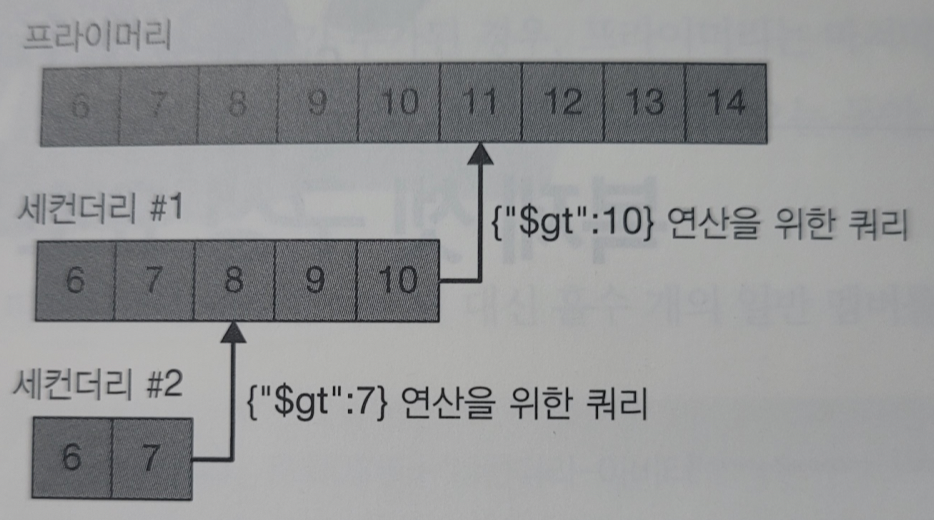
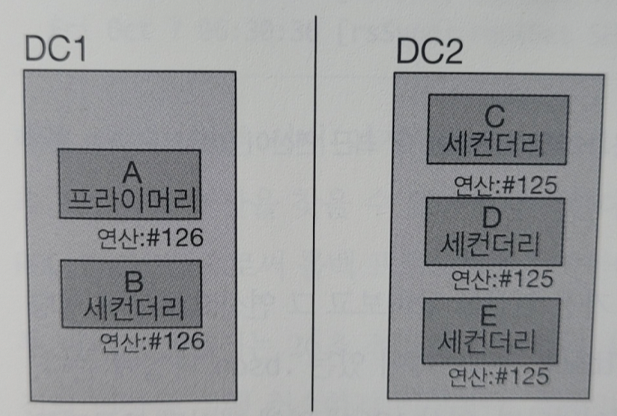
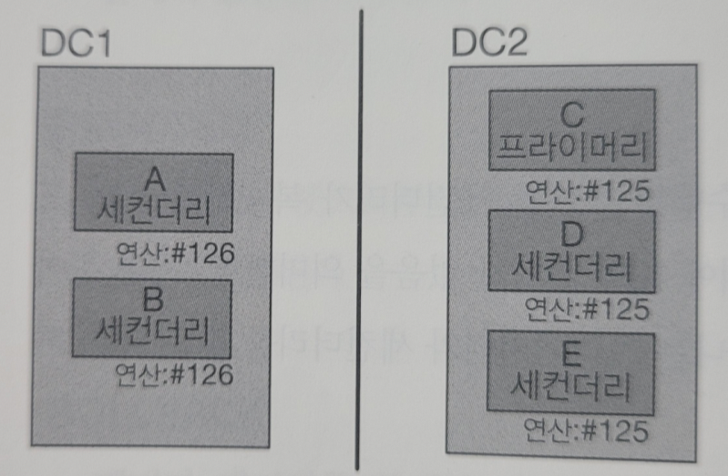
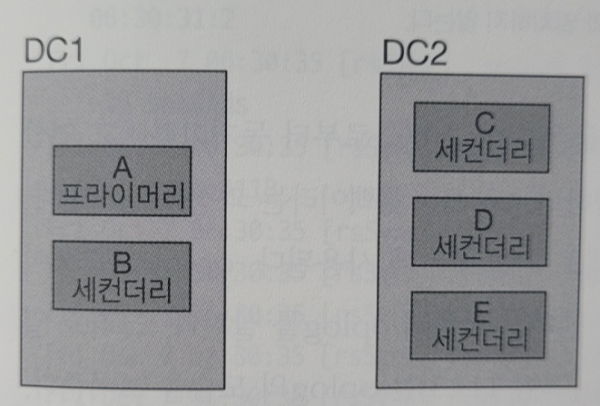

# 복제 셋 구성 요소

## 동기화

- 몽고DB는 프라이머리가 수행한 ‘쓰기’ 작업 담겨있는 oplog를 보관함으로써 복제를 수행한다
- oplog는 프라이머리의 로컬 데이터베이스에 있는 제한 컬렉션이고, 세컨더리는 이 컬렉션에 복제를 위한 연산을 쿼리한다
- 각 세컨더리는 프라이머리로부터 복제한 작업을 각각 기록하는 oplog를 보관한다
    - 세컨더리는 동기화하는 멤버로부터 연산을 가져와서 데이터셋에 적용한 뒤 자신의 oplog에 쓴다
    - 만약 연산 적용에 실패하면 세컨더리는 종료된다
        
        
        
- 세컨더리가 다운되면
    - 재시작할 때 oplog에 있는 마지막 연산과 동기화한다
    - 연산이 데이터에 적용되고 oplog에 쓰이면, 세컨더리는 그 연산을 재생할 수 있다
    - oplog의 각 작업은 ‘멱등’이다
        - oplog 연산은 여러번 재생해도 같은 결과를 얻는다
        - 즉, 대상 데이터셋에 한 번 적용되든 여러번 적용되든 동일하다
- 고정된 크기의 oplog
    - oplog는 크기가 고정되어 있기 때문에 담을 수 있는 연산의 수가 정해져있다
    - 일반적으로는 oplog는 쓰기 연산이 시스템에 적용될 때와 비슷하게 공간을 차지한다
    (프라이머리에 쓰기 연산이 분당 1킬로바이트가 발생한다면, oplog도 대략 분당 1킬로바이트씩 채워진다)
    - 삭제나 다중갱신처럼 여러 도큐먼트에 영향을 미치는 연산은 여러 개의 oplog 항목으로 분할된다
    - 연산 하나가 프라이머리에 수행되면, 영향받는 도큐먼트 당 하나씩 oplog 항목으로 분할되기 때문에, remove()로 컬렉션에 있는 도큐먼트 중 100만개를 삭제하면 oplog 항목 100만개가 도큐먼트를 하나씩 삭제한다
- **한번에 여러 도큐먼트 갱신**
    - oplog는 멱등성을 유지하기 위해 다중갱신을 개별 작업으로 변환해야 한다
    - 이 때 oplog 공간을 많이 차지할 수 있으며, 데이터 크기나 디스크 사용은 이에 상응해 증가하지 않는다
- **삽입한 데이터와 동일한 양의 데이터 삭제**
    - 삽입한 데이터와 거의 같은 양의 데이터를 삭제하면 데이터베이스는 디스크 사용량 측면에서 크게 증가하지는 않지만 oplog 크기는 상당히 클 수 있다
- **상당한 수의 내부 갱신**
    - 워크로드 상당 부분이 도큐먼트 크기를 증가시키지 않는 갱신이라면, 데이터베이스가 기록하는 작업의 수는 많지만 디스크상 데이터 양은 변하지 않는다
- 몽고DB에서 데이터 동기화는 2가지 형태이다
    - 전체 데이터셋으로 새 멤버를 채우는 ‘초기 동기화’
    - 전체 데이터 셋에 지속적인 변경 사항을 적용하는 ‘복제’

### 초기 동기화

- 몽고DB는 초기 동기화를 수행해 복제 셋의 한 멤버에서 다른 멤버로 모든 데이터를 복사한다
- 제일 먼저, 유효한 상태인지 확인
    - 복제 셋 멤버는 시작할 때, 다른 멤버와 동기화를 시작하기에 유효한 상태인지 확인한다
    - 유효하다면 복제 셋의 다른 멤버의 데이터 전체를 복사한다
- 몽고DB는 local 데이터베이스를 제외한 모든 데이터베이스를 복제한다
- mongod는 각 소스 데이터베이스 내의 컬렉션을 모두 스캔하고 모든 데이터를 대상 멤버에 있는 자체 컬렉션 복사본에 삽입한다
- ‼ mongod는 데이터를 모두 삭제하는 작업을 가장 먼저 수행한다
    - 대상 멤버의 기존 데이터는 복제 작업을 시작하기 전에 삭제된다
    - 따라서 초기 동기화는 해당 데이터 디렉터리에 있는 데이터가 필요 없거나 데이터를 다른 곳으로 옮겼을 때만 수행해야 한다
- 각 컬렉션에서 도큐먼트가 복사 될 때 모든 컬렉션 인덱스를 구축한다
    - 하지만 몽고DB 3.4 이전 버전에서는 _id 인덱스만 구축되었다
- 모든 데이터베이스가 복제되면 mongod는 소스의 oplog를 사용해 복제 셋의 현재 상태를 반영하도록 데이터셋을 갱신하고,
복사가 진행되는 동안 발생한 데이터셋에 모든 변경사항을 적용한다
(즉, mongod는 복제자가 발견하지 못한 도큐먼트를 재복제해야한다)
- 더 바람직한 작업은 백업으로부터 복원
    - 초기 동기화는 운영자 관점에서 쉬운 작업이다
    - 데이터 디렉토리가 깔끔한 상태에서 mongod를 시작하면 된다
    - 하지만 더 바람직한 방법은 백업으로부터 복원하는 방식이다
    - 백업으로부터 복원하면 mongod를 통해 모든 데이터를 복사할 때보다 빠를 때가 많다
- 초기 동기화의 단점
    - 초기 동기화를 수행하면 해당 멤버는 자주 사용되는 데이터를 축출해 메모리로 페이징하며 이는 멤버가 급격하게 느려지게 한다
    - 램에 있는 데이터로 처리하던 요청들이 갑자기 디스크로 향하기 때문이다
    - 초기 동기화를 수행하면 시간이 오래 걸리는 문제가 흔히 발생한다
    - 새로운 멤버는 동기화 소스의 oplog 끝부분으로 밀려날 수 있고, 동기화 소스를 따라잡을 수 없을 정도로 뒤쳐져버린다
    - 동기화 소스는 oplog는 새로운 멤버가 계속 복제해야 하는 데이터를 덮어쓰기 때문이다
    - 따라서 초기 동기화는 데이터셋이 작고 서버에 여유 공간이 있을 때 쉽고 좋은 방법이다

### 복제

- 몽고DB가 수행하는 두 번째 동기화 유형은 복제이다
- 세컨더리 멤버는 초기 동기화 후 지속적으로 데이터를 복제한다
- 동기화 소스에서 oplog를 복사한 후 이러한 작업을 비동기 프로세스에 적용한다
- 세컨더리는 ping 시간 및 다른 멤버의 복제 상태 변경에 따라 필요에 따라 동기화 소스를 자동으로 변경할 수 있다

### 실효 처리

- 실효 상태 발생
    - 세컨더리는 동기화 소스상에서 수행된 실제 연산들보다 훨씬 뒤떨어지면 곧 **실효 상태**가 된다
    - 동기화 소스의 모든 연산이 실효 세컨더리보다 훨씬 앞서기 때문에 실효 세컨더리가 소스의 모든 연산을 따라잡는 것은 불가능하다
    - 이는 세컨더리가 다운타임 중이거나, 쓰기 요청이 처리량을 뛰어넘거나, 읽기 작업 때문에 매우 바쁠 때 발생한다
- 세컨더리가 실효 상태가 되면, 복제 셋의 각 멤버로부터 차례로 복제를 시도해 독자적으로 이해할 수 있는 긴 oplog를 갖는 멤버가 있는지 확인한다
- 충분히 긴 oplog를 갖는 멤버를 발견하지 못하면 해당 멤버에서 복제가 중지되고 완전히 재동기화돼야 한다
- 세컨더리가 동기화되지 못하는 상황을 피하려면, 프라이머리가 많은 양의 연산 이력을 보관하도록 큰 oplog를 가져야 한다 (큰 oplog는 더 많은 디스크 공간을 사용하지만 감수할만하다)

## 하트비트

- 멤버는 다른 멤버의 상태 정보를 알아야 한다
    - 누가 프라이머리인지
    - 누구로부터 동기화해야 하는지
    - 누가 다운됐는지
- 멤버는 복제 셋에 대한 최신 정보를 유지하기 위해 복제 셋의 모든 멤버로 2초마다 하트비트 요청을 보낸다
- 프라이머리가 더는 서버의 과반수에 도달할 수 없다면, 스스로를 강등하여 세컨더리가 된다

### 멤버 상태

`STARTUP`

- 처음 시작할 때의 상태
- 멤버의 복제 셋 구성 정보 로드를 시도한다
- 구성 정보가 로드되기 전까지의 단계이다

`STARTUP2`

- 구성 정보가 로드되고 난 후 상태이다
- 이 상태는 초기 동기화 과정 전반에 걸쳐 지속된다
- 복제와 선출을 다루기 위해 몇몇 스레드로 분리된다

`RECOVERING`

- 멤버가 올바르게 작동하지만 읽기 작업은 수행할 수 없는 상태이다
- 조금 과부화된 상태라고 볼 수 있다
- 모든 멤버는 시작하고 세컨더리가 되기 전에 짧게 RECOVERING 상태를 거친다
- 멤버는 다른 멤버들보다 너무 많이 뒤쳐질 때 따라잡기 위해 RECOVERING 상태가 될 수 있다

`ARBITER`

- 아비터는 일반적인 연산 중에는 특수한 상태인 ARBITER를 유지한다

`DOWN`

- 멤버가 살아 있지만 도달할 수 없는 상태이다

`UNKNOWN`

- 멤버가 다른 멤버에 도달한 적이 없어서 상태를 전혀 알 수 없는 상태이다
- 일반적으로 알 수 없는 멤버가 다운됐거나 두 멤버간에 네트워크 문제가 있음을 나타낸다

`REMOVED`

- 멤버가 복제 셋으로부터 제거된 상태이다

`ROLLBACK`

- 멤버가 데이터를 롤백할 때이다
- 롤백 과정 마지막에는 RECOVERING 상태로 전환되고 세컨더리가 된다

## 선출

- 멤버가 프라이머리에 도달하지 못하지만 본인이 프라이머리가 될 자격이 있다면, 프라이머리 선출을 모색한다
- 선출되고자 하는 멤버는 도달할 수 있는 모든 멤버에 알림을 보낸다
- 알림을 받은 멤버는 해당 멤버가 프라이머리가 될 자격이 있는지 알아본 후 투표한다
- 반대할 이유가 없다면 선출되고자 하는 멤버에 투표하는데 과반수 득표를 하면 해당 멤버는 프라이머리 상태로 전환된다

## 롤백

- 롤백이 발생하는 과정
    - 두 개의 데이터 센터가 있다
        
        
        
    - 두 데이터센터 간 네트워크 파티션이 존재한다고 가정한다
    (DC1의 서버들은 126까지 연산이 있지만, DC2에 복제되지 않았다)

        
        
    - 프라이머리가 새롭게 선출되어 쓰기를 수행한다

        
        
    - 네트워크가 복구되면 DC1의 서버들은 다른 서버들로부터 동기화하려고 연산 126을 찾지만 찾을 수 없다
    - 이 때, 롤백이라는 과정을 시작한다
    - 복구 전에 복제되지 않은 연산을 원래 상태로 되돌린다
    - oplog에 126이 이쓴 서버들은 공통 지점을 찾으려고 다른 데이터 센터 서버들의 oplog를 살핀다
    - 가장 최신 연산이 125임을 발견하고 125까지 롤백을 진행한다

### 롤백이 실패할 경우

- 몽고DB 4.0 이전 버전에서는 롤백이 수행되기에 너무 큰지 여부를 결정할 수 있었다
- 데이터가 300메가바이트를 초과하거나 롤백에 30분 이상 걸리면 실패할 수 있다
- 이러한 현상은 세컨더리가 뒤쳐지고 프라이머리가 다운될 때 가장 흔히 발생한다
- 세컨더리 중 하나가 프라이머리가 되면 이전 프라이머리로부터 많은 연산을 놓친다
- 멤버가 롤백에 갇히게 하지 않으려면 세컨더리를 가능한 최신의 상태로 유지해야 한다